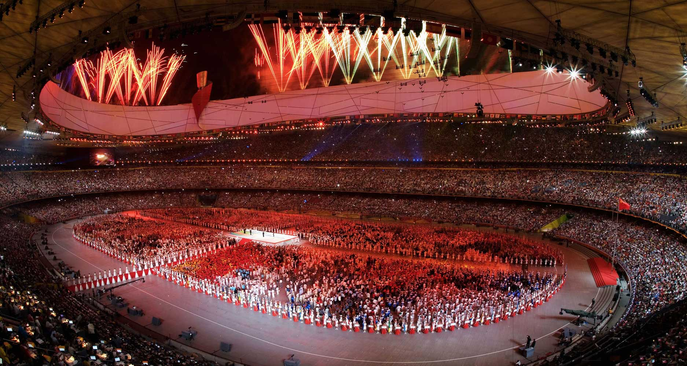

# TidyData-Project
 This repository will contain my Tidy Data Project

🏅 Tidy Data Project: 2008 Olympic Medal Analysis

📌 Project Overview
This project explores and cleans a dataset of Olympic medalists from the 2008 Summer Olympics, focusing on reshaping a wide-format dataset into tidy format to enable meaningful analysis and visualization.

The primary goals are to:

- Reshape the dataset so that each variable has its own column, each observation its own row, and each observational unit its own table.
- Create insightful visualizations that highlight medal distributions across sports, gender, and medal types.
- Practice core tidy data principles as outlined by Hadley Wickham and used by data professionals everywhere.

Tidy data principles:
1. Each variable forms a column
2. Each observation forms a row
3. Each type of observational unit forms a table

🚀 How to Run This Project

The notebook is designed for Google Colab or any local Jupyter environment.
✅ Requirements
Before running the notebook, make sure you have the following Python packages installed:
- pip install pandas matplotlib seaborn

  
📂 Steps to Run
1. Upload Dataset: The notebook prompts for file upload — use olympics_08_medalists.csv provided.
2. Run all cells from top to bottom.

The notebook performs:
- Data inspection
- Data transformation (tidying)
- Validation and cleaning
- Multiple visualizations and summaries
- 📊 Dataset Description

File: olympics_08_medalists.csv
Rows: Individual athletes
Columns: Medalist name and binary indicators for each gendered sport column (e.g., male_archery, female_swimming, etc.)

🔧 Pre-processing Steps
Used pd.melt() to unpivot wide-format sport columns into a long format
Extracted:
- Sport name (cleaned and standardized)
- Gender (from column names)
- Removed missing values and rows without medals
- Cleaned up typos and formatting inconsistencies in sport names (e.g., "ncing" → "fencing")

📈 Visualizations
Here are some of the key visual outputs from the notebook:

🥇 Medal Count by Sport
Bar chart showing the top 10 sports by total number of medals awarded.

👥 Medal Count by Gender
Grouped bar chart comparing male vs. female medal counts per sport.

🥉 Medal Type Distribution
Horizontal bar chart showing the number of bronze, silver, and gold medals.

🧁 Pie Chart: Sports by Medal Share
Visualizes the percentage breakdown of medals by sport (top 10).

📊 Stacked Bar Chart: Medal Types by Sport
Shows medal types (gold/silver/bronze) stacked for each sport.

📚 References

📄 Tidy Data Paper by Hadley Wickham
🧾 Pandas Cheat Sheet
📘 Matplotlib Pyplot Docs
📘 Seaborn Docs
📌 Key Learnings

How to identify and convert wide-format data into tidy format using pd.melt().
How to extract multiple variables from a single column using str.replace() and regex.
How to apply data cleaning best practices like .dropna(), .duplicated(), and .value_counts().
How to create clear, effective visualizations for data storytelling using matplotlib and seaborn.
Reinforced understanding of gender representation and event structures in Olympic sports.
🧠 Author Notes

This project showcases a real-world example of the importance of data structure when doing analysis.
It also highlights how seemingly small issues (e.g., "male_" in "female_") can affect logic and results.
Each step was deeply commented and documented using Markdown, and care was taken to align with tidy data theory.

Tidy_Data_Project/
│
├── olympics_08_medalists.csv           # Source dataset
├── Tidy_Data_Project_Notebook.ipynb    # Main code notebook
├── README.md                           # This file
└── screenshots/                        # Folder containing saved images of plots
    ├── top_10_sports_bar.png
    ├── gender_comparison.png
    ├── medal_type_distribution.png
    ├── top_10_sports_pie.png
    └── medal_distribution_by_sport.png

<code></code>

 
<code></code>

<code></code>

<<<<<<< HEAD
<code></code>
<code></code>

Terminal
=======
<code></code>
>>>>>>> 526d64b1f977b74dc055930b118c184cc37e4220
